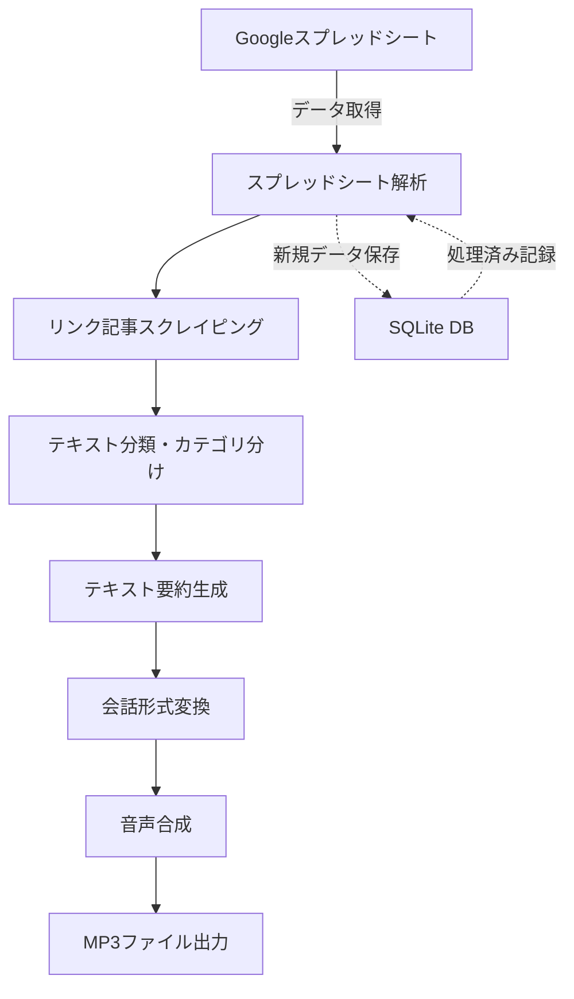

# Twitter Audio Podcast システム設計書

## システムアーキテクチャ

全体のシステムフローは以下の通りよい：



## コンポーネント詳細

### 1. スプレッドシート連携モジュール

**目的**：Google スプレッドシートから過去 1 週間分のツイートデータを取得するよい

**主な機能**：

- スプレッドシート API を使用したデータ取得
- 日付に基づくフィルタリング
- 既に処理済みのデータをスキップする仕組み

**技術要素**：

- googleapis ライブラリ
- OAuth2 認証
- 日付処理ロジック

### 2. Web スクレイピングモジュール

**目的**：ツイート内のリンクからウェブページの内容を取得するよい

**主な機能**：

- URL からの本文テキスト抽出
- HTML の構造解析
- メタデータの収集（タイトル、サイト名、公開日など）

**技術要素**：

- puppeteer/cheerio
- URL 解析
- コンテンツ抽出アルゴリズム
- エラーハンドリング（リンク切れ、アクセス拒否など）

### 3. テキスト分類モジュール

**目的**：収集したコンテンツを「技術系」と「それ以外」に分類するよい

**主な機能**：

- テキストの内容に基づくカテゴリ分類
- キーワードや文脈に基づく技術系コンテンツの識別

**技術要素**：

- OpenAI API を使用した分類
- テキスト前処理（クリーニング、トークン化）
- 分類信頼度スコア

### 4. 要約生成モジュール

**目的**：取得したコンテンツを適切な長さで要約するよい

**主な機能**：

- リンク記事の本文要約
- ツイート本文の補完的な分析
- カテゴリに応じた要約の詳細度調整（技術系は詳細に）

**技術要素**：

- OpenAI API を用いた要約生成
- 要約長のコントロール
- 重要キーポイントの抽出ロジック

### 5. 会話形式変換モジュール

**目的**：要約したコンテンツを自然な会話形式に変換するよい

**主な機能**：

- 一人のキャラクターによる解説形式への変換
- 自然な話し言葉スタイルの適用
- コンテンツのつながりを持たせる会話フロー生成

**技術要素**：

- OpenAI API による会話生成
- プロンプトエンジニアリング
- キャラクター設定の一貫性維持

### 6. 音声合成モジュール

**目的**：会話形式のテキストを MP3 形式の音声に変換するよい

**主な機能**：

- テキストから音声への変換
- MP3 ファイル生成
- 音声特性の調整（速度、トーン、など）

**技術要素**：

- 音声合成 API（ElevenLabs など）
- 音声ファイル処理
- 音声パラメータの最適化

### 7. データ管理モジュール

**目的**：処理データを管理し、重複処理を防止するよい

**主な機能**：

- 処理済みツイートの記録
- 生成された音声ファイルのメタデータ管理
- 実行ログの保存

**技術要素**：

- SQLite データベース
- Prisma ORM
- データ整合性確保

## データモデル設計

### SQLite データベーススキーマ

```prisma
// schema.prisma

model ProcessedTweet {
  id          Int      @id @default(autoincrement())
  tweetDate   DateTime
  account     String
  tweetLink   String   @unique
  contentLink String?
  content     String
  category    String   // "TECH" or "OTHER"
  processed   Boolean  @default(false)
  createdAt   DateTime @default(now())
  updatedAt   DateTime @updatedAt

  @@index([tweetDate])
  @@index([processed])
}

model PodcastEpisode {
  id           Int      @id @default(autoincrement())
  title        String
  fileLocation String
  duration     Int      // 秒単位
  generatedAt  DateTime @default(now())
  tweets       String   // 含まれるツイートIDのJSON配列
}

model SystemLog {
  id        Int      @id @default(autoincrement())
  level     String   // "INFO", "WARN", "ERROR"
  message   String
  timestamp DateTime @default(now())
  details   String?
}
```

## API 利用設計

### 1. OpenAI API

**使用目的**：

- テキスト分類
- コンテンツ要約
- 会話形式変換

**プロンプト設計例**：

```typescript
// テキスト分類プロンプト
const classificationPrompt = `
以下のコンテンツが技術系かそれ以外かを判断してください。
技術系には、プログラミング、ソフトウェア開発、IT業界、コンピュータサイエンス、
ハードウェア、ネットワーク、セキュリティ、人工知能などが含まれます。

コンテンツ:
"""
${content}
"""

回答形式: { "category": "TECH" or "OTHER", "confidence": 0-1の数値, "reasoning": "理由の説明" }
`;

// 要約プロンプト
const summarizationPrompt = `
以下のコンテンツを要約してください。このコンテンツは${
  category === "TECH" ? "技術系" : "その他の分野"
}に関するものです。
${
  category === "TECH" ? "技術的な詳細を保持しつつ、" : ""
}重要なポイントを抽出して要約してください。

コンテンツ:
"""
${content}
"""

要約の長さ: 約${category === "TECH" ? "500" : "300"}単語
`;

// 会話形式変換プロンプト
const conversationPrompt = `
以下の要約コンテンツを、一人のキャラクターが語るラジオ番組風の形式に変換してください。
キャラクターは知的で親しみやすく、時折ユーモアを交えながら話します。
特に技術系のコンテンツについては詳しく解説し、専門用語があれば簡単な説明を加えてください。

要約コンテンツ:
"""
${summary}
"""

話し言葉で、自然な会話の流れを作ってください。
`;
```

### 2. Google Sheets API

**使用目的**：

- スプレッドシートからのデータ取得

**実装例**：

```typescript
import { google, sheets_v4 } from "googleapis";

async function getSpreadsheetData(
  spreadsheetId: string,
  range: string
): Promise<any[][]> {
  const auth = new google.auth.GoogleAuth({
    keyFile: "credentials.json",
    scopes: ["https://www.googleapis.com/auth/spreadsheets.readonly"],
  });

  const client = await auth.getClient();
  const sheets = google.sheets({ version: "v4", auth: client });

  const response = await sheets.spreadsheets.values.get({
    spreadsheetId,
    range,
  });

  return response.data.values || [];
}
```

### 3. 音声合成 API

**使用目的**：

- テキストから MP3 音声ファイルの生成

**実装例**（ElevenLabs の場合）：

```typescript
import axios from "axios";
import fs from "fs";

async function generateSpeech(
  text: string,
  voiceId: string,
  outputPath: string
): Promise<void> {
  const apiKey = process.env.ELEVENLABS_API_KEY;

  const response = await axios({
    method: "post",
    url: `https://api.elevenlabs.io/v1/text-to-speech/${voiceId}`,
    headers: {
      Accept: "audio/mpeg",
      "Content-Type": "application/json",
      "xi-api-key": apiKey,
    },
    data: {
      text,
      model_id: "eleven_monolingual_v1",
      voice_settings: {
        stability: 0.5,
        similarity_boost: 0.75,
      },
    },
    responseType: "arraybuffer",
  });

  fs.writeFileSync(outputPath, response.data);
}
```

## エラーハンドリング戦略

### 1. 段階的回復

各プロセスステップでエラーが発生した場合の対応策：

- スプレッドシートアクセスエラー → 再試行ロジック
- スクレイピングエラー → 代替手法（メタデータのみ使用）へのフォールバック
- API 呼び出しエラー → レート制限を考慮した再試行
- 要約生成エラー → 簡略要約モードへの切り替え
- 音声合成エラー → テキスト結果の保存

### 2. ロギングシステム

SQLite の SystemLog テーブルを活用した詳細なロギングよい。

```typescript
async function logSystemEvent(
  level: "INFO" | "WARN" | "ERROR",
  message: string,
  details?: any
): Promise<void> {
  await prisma.systemLog.create({
    data: {
      level,
      message,
      details: details ? JSON.stringify(details) : null,
    },
  });
}
```

## パフォーマンス最適化

1. **バッチ処理**:

   - 複数ツイートをグループ化して処理
   - API 呼び出しの最適化

2. **並行処理**:

   - 複数リンクの同時スクレイピング
   - 非依存タスクの並列実行

3. **キャッシング**:

   - 取得したウェブコンテンツのキャッシング
   - API 応答のローカルキャッシュ

4. **リソース管理**:
   - 長時間実行タスクのタイムアウト設定
   - メモリ使用量の監視と制御

## ディレクトリ構造

```
twitter-audio/
├── src/
│   ├── config/                 # 設定ファイル
│   │   ├── index.ts            # 設定のエクスポート
│   │   └── constants.ts        # 定数定義
│   │
│   ├── services/               # 各サービスモジュール
│   │   ├── sheets.ts           # Googleスプレッドシート連携
│   │   ├── scraper.ts          # Webスクレイピング
│   │   ├── classifier.ts       # テキスト分類
│   │   ├── summarizer.ts       # 要約生成
│   │   ├── converter.ts        # 会話形式変換
│   │   └── tts.ts              # 音声合成
│   │
│   ├── models/                 # データモデル
│   │   ├── tweet.ts            # ツイートデータモデル
│   │   ├── content.ts          # コンテンツモデル
│   │   └── podcast.ts          # Podcastモデル
│   │
│   ├── db/                     # データベース関連
│   │   ├── index.ts            # Prismaクライアントのエクスポート
│   │   └── migrations/         # マイグレーションファイル
│   │
│   ├── utils/                  # ユーティリティ
│   │   ├── logger.ts           # ロギングユーティリティ
│   │   ├── date.ts             # 日付処理ユーティリティ
│   │   └── error-handler.ts    # エラーハンドリング
│   │
│   ├── types/                  # 型定義
│   │   └── index.ts            # タイプ定義
│   │
│   └── index.ts                # アプリケーションのエントリーポイント
│
├── prisma/                     # Prisma設定
│   └── schema.prisma           # データベーススキーマ
│
├── scripts/                    # スクリプト
│   └── setup.ts                # セットアップスクリプト
│
├── tests/                      # テスト
│   ├── unit/                   # ユニットテスト
│   └── integration/            # 統合テスト
│
├── output/                     # 生成された音声ファイル
├── logs/                       # ログファイル
├── .env                        # 環境変数
├── .env.example                # 環境変数のサンプル
├── package.json                # パッケージ設定
└── tsconfig.json               # TypeScript設定
```

## 将来の拡張性

1. **マルチソース対応**:

   - Twitter 以外のソーシャルメディアからの入力対応
   - RSS/Atom フィードからのコンテンツ取得

2. **UI 開発**:

   - Web インターフェースの追加
   - 出力音声のカスタマイズオプション

3. **コンテンツ拡充**:

   - 複数の声優による対話形式
   - BGM や効果音の追加
   - トピックベースのエピソード構成

4. **配布機能**:
   - Podcast RSS フィード生成
   - クラウドストレージへの自動アップロード
   - 定期実行と Podcast エピソードの自動公開
